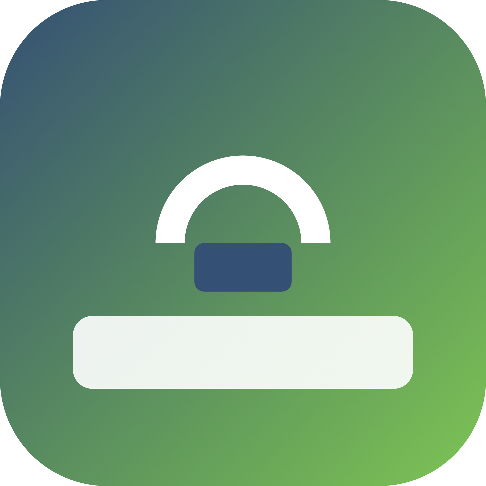
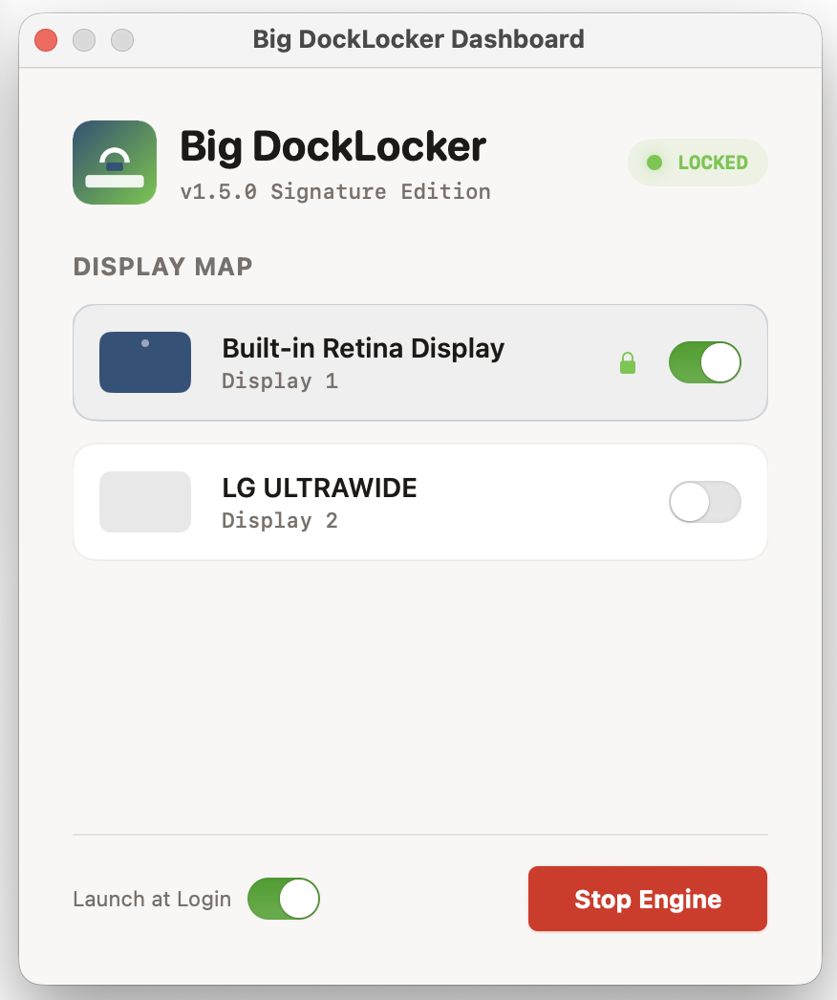

# DockLock 🔒

<p align="center">
  
</p>

[](https://swift.org)
[](https://developer.apple.com/macos/)
[](LICENSE)
[](https://github.com/semantic-release/semantic-release)

**DockLock** is a lightweight macOS utility designed to solve a long-standing frustration for multi-monitor users: the "jumping Dock." It allows you to pin the macOS Dock to a specific display and prevents it from moving to other screens, even when performing bottom-edge gestures.

**v1.3.5 Signature Edition** features a refined visual theme and professional identity.

---

## 📋 Table of Contents
- [Features](#-features)
- [Screenshots](#-screenshots)
- [Prerequisites](#-prerequisites)
- [Installation](#-installation)
- [Usage](#-usage)
- [Technical Architecture](#-technical-architecture)
- [Contributing](#-contributing)
- [License](#-license)
- [Acknowledgments](#-acknowledgments)

---

## 📥 Download

You can download the latest pre-built version of **DockLock** from the [Releases](https://github.com/danielvm-git/docklock/releases) page.

1.  Download the `DockLock Installer (macOS)` (`.dmg` file).
2.  Open the file and drag `DockLock` to your `/Applications` folder.
3.  Launch the app and follow the [Permissions](#2-permissions-crucial) guide below.

---

## 🚀 Features

- **Persistent Dock Pinning:** Choose which monitor should hold the Dock and keep it there.
- **Gesture Blocking:** Actively prevents the mouse from triggering the Dock relocation gesture on non-primary displays.
- **Native SwiftUI Dashboard:** Simple interface to manage your monitor setup and engine status.
- **Menu Bar Integration:** Runs as a resident utility in the system tray.
- **Launch at Login:** Option to start automatically when you log into your Mac.
- **Automated Releases:** Continuous delivery via `semantic-release` and GitHub Actions.

---

## 📸 Screenshots

<p align="center">
  
</p>

---

## ⚙️ Prerequisites

Before you begin, ensure you have met the following requirements:
*   You have a macOS machine running **macOS 14 (Sonoma) or newer**.
*   You have installed **Xcode 15+** or the latest Swift command-line tools.

---

## 🛠 Installation

### 1. Build from Source
Clone the repository and run the setup script to build and package the `.app` bundle:

```bash
git clone https://github.com/danielvm-git/docklock.git
cd docklock
./run.sh
```

### 2. Permissions (Crucial)
MacOS requires **Accessibility Permissions** to allow DockLock to monitor mouse movements for the "anti-jumping" logic.

1.  A new folder named `DockLock.app` will be created in your directory.
2.  Open **System Settings > Privacy & Security > Accessibility**.
3.  Drag the `DockLock.app` bundle from your project folder into the settings list.
4.  Toggle the switch to **ON**.

---

## 💡 Usage

1.  Run `./run.sh` (or launch the `DockLock.app` directly from Finder).
2.  Click the lock icon in your **Menu Bar** and select **Dashboard**.
3.  Choose which display you want to pin the Dock to.
4.  Click **Start Engine**. The app will now intercept bottom-edge mouse gestures on your other monitors.

---

## 🛠 Troubleshooting

### "Apple could not verify 'DockLock' is free of malware"

This is the standard macOS Gatekeeper dialog for any app that hasn't been **Notarized by Apple**. DockLock is ad-hoc signed but not notarized (notarization requires a paid Apple Developer Program membership — it's on the roadmap). The source is fully auditable in this repository.

The bypass is one-time per install.

#### Recommended: remove the quarantine flag (Terminal)

This works on every macOS version and skips the dialog entirely on the next launch:

```bash
xattr -dr com.apple.quarantine /Applications/DockLock.app
```

Or run the included helper script from a clone of the repo:

```bash
./scripts/fix-quarantine.sh
```

#### GUI bypass on macOS 15 Sequoia (System Settings)

On Sequoia, Apple **removed** the old right-click → Open shortcut for this specific "free of malware" dialog. The current path is:

1.  Double-click `DockLock.app` in `/Applications`. macOS will show the warning and refuse to launch.
2.  Open **System Settings → Privacy & Security**.
3.  Scroll to the security message that reads "DockLock was blocked to protect your Mac." Click **Open Anyway**.
4.  Authenticate with Touch ID or your password.
5.  Click **Open** in the confirmation dialog. The app launches and won't prompt again.

#### macOS 14 (Sonoma) and earlier

The old right-click trick still works for the *legacy* "unidentified developer" dialog, but **not** for the newer "free of malware" dialog on Sequoia:

1.  In `/Applications`, **right-click** (or Control-click) the **DockLock** icon and select **Open**.
2.  Click **Open** in the dialog.


---

DockLock is built with **Swift 6** and **SwiftUI**, utilizing low-level macOS APIs for its core functionality:

- **Core Graphics (`CGEventTap`):** Intercepts and modifies mouse movement events at the system level.
- **Accessibility API (`AXUIElement`):** Required for the event tap to function as a trusted process.
- **ServiceManagement (`SMAppService`):** Handles the modern macOS "Launch at Login" registration.
- **CoreGraphics (`CGDirectDisplayID`):** Manages multi-monitor identification and coordinate mapping.

### Testing
Run the automated test suite to verify coordinate logic and manager interfaces:
```bash
swift test
```

---

## 🤝 Contributing

Contributions are what make the open-source community such an amazing place to learn, inspire, and create. Any contributions you make are **greatly appreciated**.

1. Fork the Project
2. Create your Feature Branch (`git checkout -b feature/AmazingFeature`)
3. Commit your Changes (`git commit -m 'feat: Add some AmazingFeature'`) - *Note: This project uses Conventional Commits.*
4. Push to the Branch (`git push origin feature/AmazingFeature`)
5. Open a Pull Request

---

## 📜 License

Distributed under the MIT License. See `LICENSE` for more information.

---

## 🌟 Acknowledgments

*   Concept inspired by the excellent [DockLock Pro](https://docklockpro.com/).
*   Developed using the [bigpowers](https://github.com/danielvm-git/bigpowers) AI orchestration methodology.
